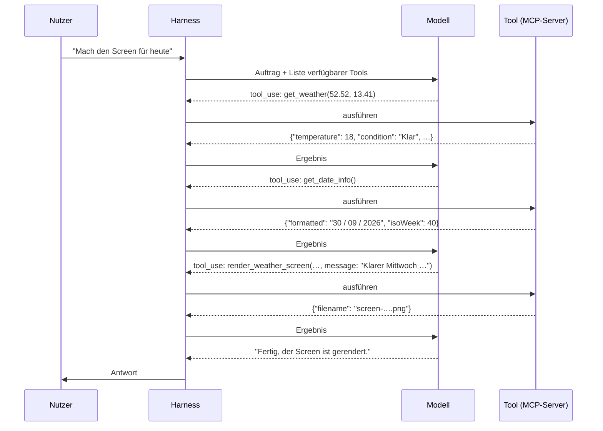

# 1 · Die Bausteine

**Weder Modell noch Harness können allein etwas.** Das Modell denkt und entscheidet,
kann aber nur Text erzeugen. Der Harness ist die Werkzeugkiste drumherum mit
Chat-Kontext, Tool-Aufrufen und Berechtigungen, trifft aber selbst keine einzige
Entscheidung. **Erst zusammen entsteht ein Agent.** Weitere Werkzeuge kommen über
MCP in standardisierter Form dazu.

## Fünf Begriffe, sauber getrennt

| Begriff | Was es ist | Im Projekt |
|---|---|---|
| **Modell (LLM)** | Eine Funktion, in die Text hineingeht und aus der Text herauskommt. Kein Gedächtnis, kein Zugriff auf irgendetwas. | Claude, DeepSeek, ein lokales Qwen über Ollama |
| **Tool** | Eine Funktion mit Name, Beschreibung und Parameterschema, die das Modell *anfordern* kann | `get_weather(lat, lon)` |
| **Harness** | Die Werkzeugkiste um das Modell. Sie verwaltet den Chat-Kontext, stellt Tools bereit, führt die vom Modell angeforderten Aufrufe aus und prüft Berechtigungen. **Ohne Modell passiert nichts.** | Claude Code, pi |
| **Agent** | Modell, Harness, Tools und Auftrag zusammen, also ein System, das selbstständig mehrere Schritte bis zum Ziel geht | „Mach den Screen für heute“ |
| **MCP** | Offenes Protokoll, über das ein Harness Tools aus externen Servern einbindet | Unser `trmnl-display`-Server |

## Das Modell ruft nichts selbst auf

Das ist die wichtigste Einsicht. **Das Modell schreibt nur eine strukturierte Bitte**,
etwa „ich möchte `get_weather` mit `lat=52.52, lon=13.41` aufrufen“. **Ausgeführt
wird der Aufruf vom Harness.** Das Ergebnis kommt als Text zurück in den Kontext, und
das Modell macht weiter.

## Arbeitsteilung zwischen Kopf und Werkzeugkiste

| Das Modell … | Der Harness … |
|---|---|
| versteht den Auftrag | nimmt den Auftrag entgegen und schickt ihn samt Verlauf ans Modell |
| entscheidet, welches Tool mit welchen Werten nötig ist | bietet die Tools an und führt den Aufruf aus |
| bewertet das Ergebnis und plant den nächsten Schritt | hängt das Ergebnis an den Kontext und fragt erneut |
| formuliert die Antwort | zeigt sie an und speichert den Verlauf |

**Der Harness ist reine Mechanik.** Er leitet weiter, führt aus und passt auf. Ohne
Modell ist er eine Werkzeugkiste, die niemand öffnet. Ohne Harness ist das Modell ein
Kopf ohne Hände.

Daraus folgen drei Punkte, die im weiteren Verlauf immer wieder auftauchen.

- **Kontrolle liegt beim Harness.** Er entscheidet nicht, *was* passiert, aber *ob*
  ein angefragter Tool-Aufruf erlaubt ist (Berechtigungen, Sandbox). Das Modell kann
  nur darum bitten.
- **Das Modell sieht nur Beschreibungen.** Welches Tool es wann nutzt, entscheidet
  es anhand von Name, Beschreibung und Schema. Deshalb sind gute Beschreibungen so
  wichtig (→ [Seite 6](06-mcp-was-zaehlt.md)).
- **Modelle sind austauschbar.** Solange ein Modell Tool-Calls beherrscht, kann
  derselbe Harness mit denselben Tools arbeiten (→ [Seite 3](03-pi-aufsetzen.md)).

## Analogie

| | |
|---|---|
| Modell | der Handwerker, der weiß, was zu tun ist, aber kein Werkzeug dabeihat |
| Harness | die Werkstatt mit Werkbank, Notizblock (Kontext) und Sicherheitsregeln, in der ohne Handwerker alles stillsteht |
| Tools | die Werkzeuge wie Wetterstation, Drucker oder Kalender |
| MCP | das Handbuch im Einheitsformat, das jedem Werkzeug beiliegt und erklärt, was es kann, wann man es nimmt und wie man es bedient. Dazu kommt ein genormter Anschluss, damit jede Werkstatt es nutzen kann |
