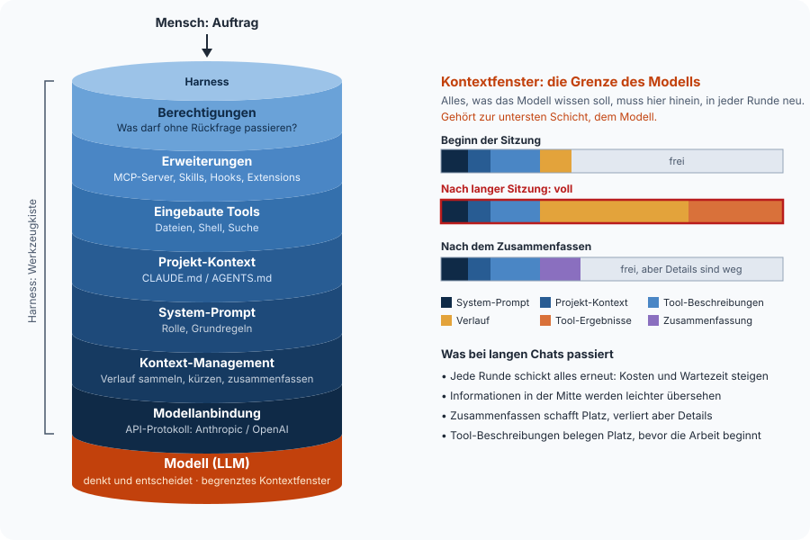

# 2 · Wie ein Harness funktioniert

Ein Harness führt das Gespräch zwischen Mensch, Modell und Werkzeugen. Er schickt
den Auftrag ans Modell, führt die angeforderten Tool-Aufrufe aus, gibt die
Ergebnisse zurück und wiederholt das, bis das Modell fertig ist. **Wie gut und wie
sicher das funktioniert, entscheiden die Schichten um diese Schleife herum.**

## Die Agenten-Schleife

Jede Runde läuft gleich ab.

1. Der Harness schickt dem Modell den bisherigen Verlauf und die Liste der Tools.
2. Das Modell antwortet entweder mit Text (dann ist es fertig) oder mit einem oder
   mehreren Tool-Aufrufen.
3. Der Harness prüft jeden Aufruf (Berechtigung) und führt ihn aus.
4. Die Ergebnisse kommen in den Verlauf, und es geht zurück zu Schritt 1.

**Das ist schon das ganze Prinzip.** Das [Sequenzdiagramm auf Seite 1](01-bausteine.md)
zeigt genau diese Runden.

## Der Harness als Schichtenmodell



Jede Schicht baut auf der darunter auf. Das Fundament ist das Modell, und seine
Grenze gilt für alle Schichten darüber. **Was der Harness dem Modell mitgeben will,
muss ins Kontextfenster passen.**

## Was einen guten Harness ausmacht

| Aufgabe | Worum es geht | Claude Code | pi |
|---|---|---|---|
| **System-Prompt** | Grundverhalten, Rolle, Regeln | fest, umfangreich | minimal, per `SYSTEM.md` ersetzbar |
| **Projekt-Kontext** | Wissen über *dieses* Projekt | `CLAUDE.md` | `AGENTS.md` (liest auch `CLAUDE.md`) |
| **Eingebaute Tools** | Dateien lesen und schreiben, Shell | viele (Suche, Web, Subagenten …) | bewusst wenige Grundwerkzeuge |
| **Berechtigungen** | Was darf ohne Rückfrage passieren? | Permission-Modi, Allow-Listen | standardmäßig keine Rückfragen, Project Trust beim Start, per Extension erweiterbar |
| **Kontext-Management** | zu langen Verlauf zusammenfassen | automatisch | automatisch, konfigurierbar |
| **Modellanbindung** | Welche Modelle, welches API-Protokoll | Claude | 15+ Anbieter, auch lokal |
| **Erweiterbarkeit** | Eigene Tools, Befehle, Abläufe | MCP, Skills, Hooks, Plugins | MCP, Skills, Extensions (TypeScript), Prompt-Templates |

Man kann es sich so vorstellen. **Claude Code ist ein fertig eingerichtetes Auto, pi
ist ein Chassis mit Motor.** Beide fahren. Bei pi entscheidet man selbst, was
angebaut wird, und genau deshalb eignet es sich, um zu zeigen, *wie* ein Harness
aufgebaut ist.

## Was das Modell in jeder Runde bekommt

**Das Modell hat nur Text.** Alles, was es „weiß“, stellt der Harness bei jedem
Aufruf aus mehreren Quellen zusammen.

| Teil | Wer schreibt es? | Wann ist es im Kontext? | Beispiel |
|---|---|---|---|
| **System-Prompt** | der Harness (vom Hersteller, anpassbar) | immer, ganz vorne | „Du bist ein Coding-Agent. Frag nach, bevor du etwas löschst.“ |
| **Projekt-Kontext** | das Team, als Datei im Projekt | immer | in `AGENTS.md` etwa „Tagesmessages max. 120 Zeichen, keine Emojis.“ |
| **Tool-Beschreibungen** | wer das Tool gebaut hat (eingebaut oder MCP) | immer, oder erst bei Bedarf | bei `get_weather` etwa „Liefert die aktuellen Wetterdaten …“ |
| **Skill-Übersicht** | wer den Skill geschrieben hat | nur Name und eine Zeile | `display-layout` mit „Regeln für E-Ink-Layouts“ |
| **User-Prompt** | der Mensch | pro Auftrag | „Mach den Screen für heute.“ |
| **Verlauf und Tool-Ergebnisse** | entsteht während der Arbeit | wächst mit jeder Runde | `{"temperature": 18, …}` |

System-Prompt und User-Prompt sind die beiden Enden. Der System-Prompt setzt den
Rahmen (Rolle, Regeln, verfügbare Werkzeuge), der User-Prompt den konkreten Auftrag.
**Widersprechen sie sich, folgen Modelle in der Regel dem System-Prompt**, darauf
sind sie trainiert. Den System-Prompt sieht der Nutzer meist nie, er macht aber einen
großen Teil des Verhaltens aus. **Deshalb verhält sich dasselbe Modell in
verschiedenen Harnesses unterschiedlich.**

### Skills als Wissen auf Abruf

Ein Skill ist ein Ordner mit einer Datei `SKILL.md` (Name, Beschreibung, Anleitung)
und optional Hilfsdateien wie Vorlagen oder Skripten. **Der Harness legt nur Name und
Beschreibung in den Kontext.** Passt ein Auftrag dazu, liest das Modell die
vollständige Anleitung nach. Das funktioniert wie ein Regal voller Handbücher, bei
dem die Titel immer sichtbar sind und nur aufgeschlagen wird, was gerade gebraucht
wird. **Das spart Kontext.**

Ein Beispiel ist ein Skill `tagesmessage` mit den Regeln für gute Display-Texte
(Länge, Ton, keine Emojis, Beispiele). Beim Auftrag „Mach den Screen für heute“ lädt
das Modell ihn, bei „Erklär mir diesen Code“ nicht.

### Was wofür?

| | Liefert | Führt selbst etwas aus? | Im Kontext | Beispiel |
|---|---|---|---|---|
| **`AGENTS.md`** | Dauerwissen fürs Projekt | nein | immer, komplett | Stilregeln, Projektaufbau |
| **Skill** | Anleitung und Vorlagen für eine Aufgabe | nein, das Modell nutzt dafür die vorhandenen Tools | Übersicht immer, Inhalt bei Bedarf | Regeln für Tagesmessages |
| **Prompt-Template** | einen gespeicherten User-Prompt | nein | wenn der Mensch ihn aufruft | `/screen` |
| **MCP-Server** | Werkzeuge | **ja**, im eigenen Prozess | Tool-Beschreibungen | `get_weather` |

!!! tip "Merksatz"
    **`AGENTS.md` ist, was immer gilt. Ein Skill ist, was manchmal gebraucht wird.
    MCP ist, was etwas *tun* muss.**

## Kontext ist die knappe Ressource

Alles, was das Modell wissen soll, muss in den Kontext, also System-Prompt,
`AGENTS.md`, Tool-Beschreibungen, bisheriger Verlauf und Tool-Ergebnisse. **Und das
in jeder Runde neu, denn das Modell selbst merkt sich nichts.** Daraus folgen fünf
Dinge.

- **Lange Chats werden teurer, langsamer und ungenauer.** Irgendwann ist das Fenster
  voll, und der Harness muss zusammenfassen. Das schafft Platz, kostet aber Details.
  Für neue Aufgaben ist ein neuer Chat oft die bessere Wahl.
- **Auswählen ist besser als alles anbieten.** Eine API hat vielleicht 20 Endpunkte.
  5 gezielt ausgewählte, die zum Anwendungsfall passen, sind besser als alle 20.
  Jeder weitere belegt Kontext und ist eine weitere Gelegenheit, das falsche Werkzeug
  zu greifen.
- **Die Beschreibung entscheidet, wie gut ein Tool nutzbar ist.** Das Modell kennt
  nur den Text. Ob es ein Tool im richtigen Moment mit den richtigen Werten aufruft,
  steht und fällt mit dieser Beschreibung (→ [Seite 6](06-mcp-was-zaehlt.md)).
- **Tool-Ergebnisse sollten knapp sein.** Eine Wetter-API liefert Hunderte Felder,
  unser `get_weather` gibt nur 7 zurück.
- **Moderne Harnesses laden Tools deshalb erst bei Bedarf** (in Claude Code per Tool
  Search, in pi per `exposure: "deferred"`), oder sie lassen das Modell Tools per
  Code kombinieren (in pi der *Codemode*).

## Zum Anfassen · eine API auswählen und beschreiben

Die [JokeAPI](https://v2.jokeapi.dev/endpoints) soll dem Agenten Witze fürs Display
liefern. Sie hat **10 Endpunkte**.

| Endpunkt | Zweck |
|---|---|
| `GET /joke/{Kategorie}` | Witz abrufen |
| `GET /categories` | verfügbare Kategorien |
| `GET /languages` | unterstützte Sprachen |
| `GET /langcode/{Sprache}` | Sprachcode nachschlagen |
| `GET /flags` | Filter-Kennzeichen (nsfw, political …) |
| `GET /formats` | Antwortformate (JSON, XML …) |
| `GET /info` | Statistiken zur API |
| `GET /endpoints` | diese Liste |
| `GET /ping` | ist die API erreichbar? |
| `POST /submit` | Witz einreichen |

??? question "Welche Endpunkte braucht unser Agent wirklich?"
    **Nur einen, nämlich `GET /joke`.** Kategorien, Sprachen und Flags kennen wir
    vorher und legen sie im Schema fest, statt das Modell sie jedes Mal nachschlagen
    zu lassen. `ping`, `info` und `formats` sind Technik für Entwickler. Und `submit`
    ist ein **schreibender** Endpunkt. **Ihn einem Agenten anzubieten, wäre ein Risiko
    ohne Nutzen.**

??? question "Was liefert die API roh zurück?"
    ```bash
    curl "https://v2.jokeapi.dev/joke/Programming?lang=de&safe-mode"
    ```
    ```json
    {
      "error": false,
      "category": "Programming",
      "type": "single",
      "joke": "Täglich verschwinden hunderte Senioren im Netz, weil sie \"Alt\" und \"Entf\" drücken.",
      "flags": { "nsfw": false, "racist": false, "sexist": false,
                 "religious": false, "political": false, "explicit": false },
      "id": 17,
      "safe": true,
      "lang": "de"
    }
    ```
    **Für das Modell zählt davon nur der Witz selbst.** `flags`, `id` und `safe` sind
    Ballast im Kontext. Außerdem gibt es zwei Formate, nämlich `single` mit einem Feld
    `joke` und `twopart` mit `setup` und `delivery`.

??? question "Wie sieht das fertige Tool aus?"
    - Der **Name** ist `get_joke`.
    - Die **Beschreibung** lautet *„Liefert einen kurzen, jugendfreien Witz aus der
      Kategorie Programmierung oder gemischt. Mit `topic` kann nach einem Stichwort
      gefiltert werden (z. B. ‚coffee‘ für Kaffeewitze). Nutze es für auflockernde
      Display-Inhalte.“*
    - Die **Parameter** sind `category` (`Programming` oder `Any`), `lang` (`de` oder
      `en`) und optional `topic`.
    - Die **Rückgabe** ist immer gleich, egal ob `single` oder `twopart`, nämlich
      `{ "setup": "…", "punchline": "…", "lang": "de" }`.
    - **`safe-mode` ist fest im Code und immer an.** Das entscheidet nicht das Modell.

    Aus 10 Endpunkten und 9 Feldern wird **ein Tool mit 3 Parametern und 3 Feldern**.
    **Genau diese Auswahl ist die eigentliche Arbeit beim Bau eines MCP-Servers.**
    Details stehen in [docs-dev/07](../docs-dev/07-weitere-mcp-tools.md#get_joke).
