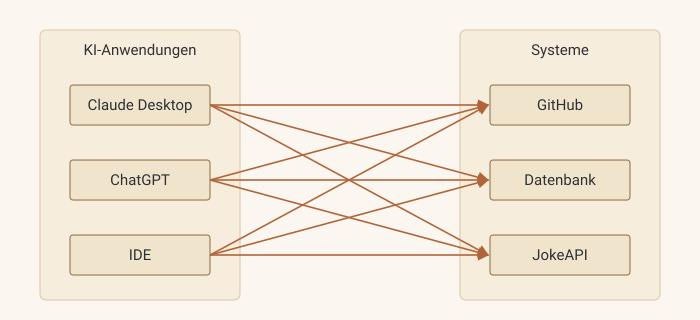

# 4 · MCP verstehen

Bevor es MCP gab, gehörte jedes Werkzeug fest zu *einer* KI-Anwendung. MCP trennt
**das Werkzeug von der Anwendung**. Das Werkzeug wird ein eigenständiger Server, der
sein Handbuch selbst mitbringt und über einen genormten Anschluss angesprochen wird.
**Einmal gebaut**, ist es in jedem MCP-fähigen Harness mit jedem Modell **nutzbar**.

## Wie Tools vor MCP funktionierten

Seit Mitte 2023 können Modelle Tools anfordern (*Function Calling*). Das Modell
schreibt die strukturierte Bitte, und die Anwendung führt sie aus, genau wie auf
[Seite 1](01-bausteine.md). Offen blieb die Frage, wo das **Tool eigentlich lebt**.

Die Antwort war, **in der Anwendung selbst**. Wer Claude Desktop, ChatGPT und einer
IDE Zugriff auf GitHub geben wollte, musste die GitHub-Anbindung dreimal schreiben,
jedes Mal im Format der jeweiligen Anwendung. Das hatte vier Folgen.

- Jede Anwendung hatte ihr **eigenes Format**. ChatGPT-Plugins, LangChain-Tools,
  IDE-Erweiterungen und eigene Function-Calling-Definitionen waren untereinander
  nicht austauschbar.
- Die Werkzeuge standen beim Bau der Anwendung **fest**. Ein neues Tool bedeutete
  eine neue Version der Anwendung.
- Der Anbieter eines Systems konnte **nichts beisteuern**. GitHub konnte keine
  Anbindung ausliefern, die überall funktioniert, weil es kein „überall“ gab.
- Zugangsdaten und Tool-Code steckten **mitten in der Anwendung**, verwoben mit dem
  Chat, dem Prompt und der Modellanbindung.

=== "Vorher baut jeder alles selbst"

    

    Jeder Pfeil ist ein Eigenbau. **3 Anwendungen × 3 Systeme = 9 Integrationen**, jede anders gebaut und jede
    einzeln zu pflegen. Bei *N* Anwendungen und *M* Systemen sind es *N × M*.

=== "Mit MCP einmal bauen, überall nutzen"

    ```mermaid
    flowchart LR
        subgraph Apps [Harnesses]
            CC[Claude Code]
            PI[pi]
            IDE[IDE]
        end
        subgraph Srv [MCP-Server]
            G[GitHub]
            DB[Datenbank]
            T[trmnl-display]
        end
        CC & PI & IDE -->|MCP| P((Protokoll))
        P --> G & DB & T
    ```

    Jeder Harness lernt MCP **einmal**, jedes System bekommt **einmal** einen Server.
    **Aus *N × M* wird *N + M*.**

## Was MCP konkret gelöst hat

Ende 2024 hat Anthropic MCP als offenen Standard veröffentlicht. Vorbild war das
*Language Server Protocol* (LSP), mit dem Microsoft 2016 dasselbe Problem bei Editoren
und Programmiersprachen gelöst hatte. Inzwischen unterstützen es **OpenAI, Google,
Microsoft** und praktisch alle Coding-Werkzeuge. Seit Ende 2025 liegt es bei einer
Stiftung unter dem Dach der Linux Foundation und gehört damit keinem einzelnen
Anbieter.

| Problem vorher | Lösung durch MCP | Bei uns |
|---|---|---|
| Tool gehört zur Anwendung | Tool ist ein **eigener Prozess**, der Server. Wer das System kennt, baut ihn. | `trmnl-display` läuft in Claude Code und pi, ohne Änderung |
| Jede Anwendung hat ein eigenes Format | **Ein Protokoll** mit `tools/list` (das Handbuch) und `tools/call` (der Anschluss) | derselbe Server für beide Harnesses |
| Tools beim Bau festgelegt | Der Harness **fragt zur Laufzeit**, was der Server kann | neues Tool im Server, der Harness kennt es ohne eigenes Update |
| Zugangsdaten in der Anwendung | Zugangsdaten **bleiben im Server**. Das Modell sieht nur Name, Beschreibung und Schema. | LaraPaper-Token und Seiten-IDs sieht das Modell nie |
| Modellwechsel heißt Integrationen neu bauen | Der Harness übersetzt MCP ins Format des Modells | DeepSeek und Claude mit denselben Tools |

!!! warning "Was MCP **nicht** löst"
    - **Gute Tools.** MCP sorgt dafür, dass das Handbuch ankommt, nicht dafür, dass es
      gut geschrieben ist (→ [Seite 6](06-mcp-was-zaehlt.md)).
    - **Vertrauen.** Ein MCP-Server ist Code, der mit Rechten läuft. Einen fremden
      Server einzubinden ist wie **fremde Software** zu installieren.
    - **Kontext.** Jedes angebundene Tool belegt Platz im Kontextfenster
      (→ [Seite 2](02-harness.md)).

## Was ein Server anbieten kann

| Baustein | Wer steuert ihn? | Beispiel |
|---|---|---|
| **Tools** | das **Modell** entscheidet, wann sie aufgerufen werden | `get_joke`, `update_page` |
| **Resources** | die **Anwendung** entscheidet, was in den Kontext kommt | z. B. aktueller Screen als Bild, Layout-Spezifikation |
| **Prompts** | der **Mensch** wählt sie aus (oft als Slash-Befehl) | z. B. `/witz` |

In der Praxis sind Tools mit Abstand **am wichtigsten**. Unser Projekt nutzt nur
Tools.

## Wie Harness und Server miteinander reden

| | **stdio** | **Streamable HTTP** |
|---|---|---|
| Aufbau | Harness startet den Server als Kindprozess, Kommunikation über stdin und stdout | Server läuft eigenständig, Harness verbindet sich über HTTP |
| Nutzer | einer (lokal) | viele (Team, Firma, Internet) |
| Sicherheit | läuft mit den Rechten des Nutzers, kein offener Port | braucht Authentifizierung (OAuth) und Origin-Prüfung |
| Typisch für | Entwicklung, lokale Werkzeuge | zentrale Dienste, SaaS-Anbindungen |
| Bei uns | ✅ | Diskussionspunkt für später |

!!! warning "Klassischer Anfängerfehler bei stdio"
    Bei stdio ist **stdout der Protokollkanal**. Ein einziges `console.log("Debug")`
    im Server schreibt Text mitten in den JSON-Strom, und die Verbindung bricht ab.
    **Logs gehören nach stderr** (`console.error`).

## Was tatsächlich über die Leitung geht

MCP basiert auf **JSON-RPC 2.0**. Eine Sitzung besteht im Wesentlichen aus drei
Schritten.

**1. Beim Handshake** stellen sich Harness und Server vor und handeln aus, was sie
können.

```json
→ { "jsonrpc": "2.0", "id": 1, "method": "initialize",
    "params": { "clientInfo": { "name": "pi" }, "capabilities": { … } } }
← { "jsonrpc": "2.0", "id": 1,
    "result": { "serverInfo": { "name": "trmnl-display" }, "capabilities": { "tools": {} } } }
```

**2. Die Tool-Liste** ist alles, was das Modell über unsere Tools erfährt.

```json
→ { "jsonrpc": "2.0", "id": 2, "method": "tools/list" }
← { "jsonrpc": "2.0", "id": 2, "result": { "tools": [{
      "name": "get_joke",
      "description": "Liefert einen kurzen, jugendfreien Witz … Nutze es, wann immer …",
      "inputSchema": { "type": "object",
        "properties": { "category": { "type": "string", "enum": ["Programming", "Any"] },
                        "lang": { "type": "string", "enum": ["de", "en"] },
                        "topic": { "type": "string", "maxLength": 30 } } } }] } }
```

**3. Der Tool-Aufruf** passiert, sobald das Modell `tool_use` zurückgibt.

```json
→ { "jsonrpc": "2.0", "id": 3, "method": "tools/call",
    "params": { "name": "get_joke", "arguments": { "category": "Programming", "lang": "de" } } }
← { "jsonrpc": "2.0", "id": 3, "result": {
      "content": [{ "type": "text",
                    "text": "{\"setup\":\"Was macht ein Informatiker …\",…}" }],
      "isError": false } }
```

Das Zod-Schema aus unserem Code wird automatisch in das `inputSchema` (JSON Schema)
übersetzt. Der Harness übersetzt dieses Schema dann in das Format des jeweiligen
Modell-Anbieters (→ Protokolle auf [Seite 3](03-pi-aufsetzen.md)). Das Modell
spricht **nie direkt MCP**, das tut **nur der Harness**. In der Spezifikation heißt der
Harness übrigens *Host*.

## Denselben Server in zwei Harnesses anbinden

Jetzt schließt sich der Kreis zu [Seite 3](03-pi-aufsetzen.md). Unser Server
`trmnl-display` kommt **in pi und in Claude Code**, ohne eine Zeile Änderung.

In pi steht er projektweit in `.pi/mcp.json`.

```json
{
  "mcpServers": {
    "trmnl-display": {
      "command": "npx",
      "args": ["tsx", "server/src/mcp-server.ts"],
      "exposure": "direct"
    }
  }
}
```

Alternativ geht es per CLI, wobei `-l` die Einstellung auf dieses Projekt beschränkt.

```bash
pi mcp add -l trmnl-display -- npx tsx server/src/mcp-server.ts
```

`command` und `args` sagen pi, wie der Server als Kindprozess gestartet wird
(Transport *stdio*, siehe oben). `exposure: "direct"` sorgt dafür, dass das Modell
die Tools **wie eingebaute Werkzeuge** sieht. Der Standard wäre `codemode`. Dort
schreibt das Modell kleines JavaScript, das die Tools aufruft. Das spart Kontext
(→ [Seite 2](02-harness.md)), ist für eine Demo aber weniger anschaulich.

Zum Vergleich der Befehl in Claude Code.

```bash
claude mcp add trmnl-display -- npx tsx server/src/mcp-server.ts
```

Es ist **derselbe Server** mit derselben Startzeile, nur in einem **anderen Harness**.
Das ist der Kern von MCP.

## Live

!!! example "Den MCP Inspector zeigen"
    ```bash
    cd server
    npx @modelcontextprotocol/inspector npx tsx src/mcp-server.ts
    ```
    Im Browser **Connect** klicken, den Tab **Tools** öffnen und `get_joke` mit einer
    Kategorie aufrufen. Dabei die Nachrichten im History-Bereich zeigen, denn sie
    sind genau das JSON von oben. Das ist ein MCP-Server **ganz ohne KI**. Das Modell
    ist nur ein weiterer Client.

!!! example "Denselben Server in beiden Harnesses zeigen"
    1. In pi `/mcp` aufrufen. `trmnl-display` ist mit seinen Tools sichtbar.
    2. In Claude Code `/mcp` aufrufen. Es ist derselbe Server mit denselben Tools.
    3. In beiden dieselbe Frage stellen, etwa *„Erzähl mir einen Programmierwitz.“*
