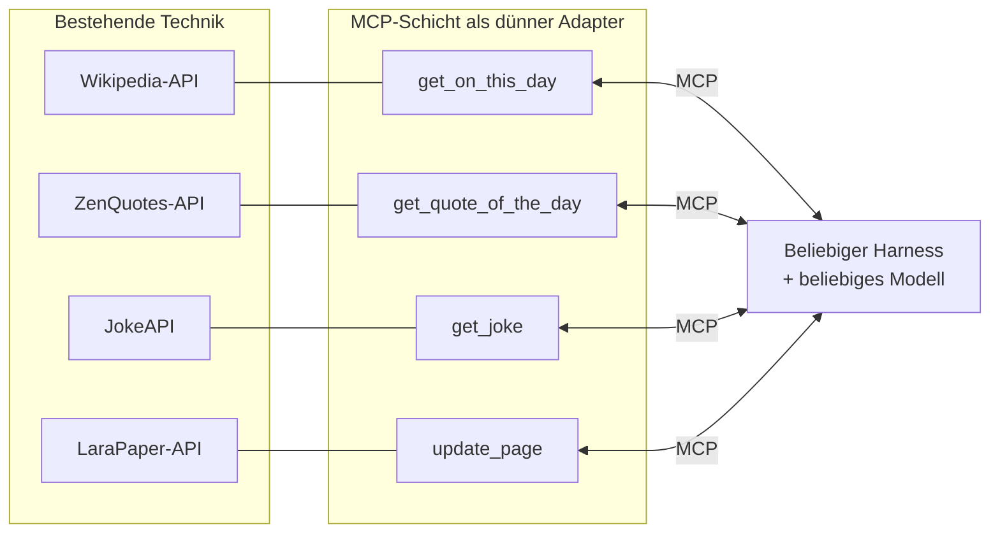
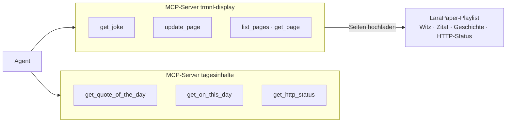

# 5 · Von der API zum MCP-Server

MCP erfindet nichts Neues, denn APIs gibt es seit Jahrzehnten. Ein MCP-Server ist
ein **Adapter mit Bedienungsanleitung** für Sprachmodelle. Er macht bestehende Systeme
für jeden Agenten nutzbar, und zwar auf eine einheitliche Art.

## Die These und wo sie genauer wird

> *„APIs gab es schon immer. MCP ist schlicht die Beschreibung, wie ein LLM/Agent diese
> API aufruft und nutzt.“*

Das stimmt **im Kern**. Vier Präzisierungen zeigen, warum MCP mehr ist als „nur Doku“.

| These | Präzisierung |
|---|---|
| „MCP beschreibt die API“ | Beschreibungen gab es schon (OpenAPI, Swagger). Neu ist, dass die Beschreibung **zur Laufzeit** abgefragt wird (`tools/list`) und jeder Harness sie **auf dieselbe Art aufruft** (`tools/call`). Der Agent muss den Server vorher nicht kennen. |
| „MCP ist die API für ein LLM“ | Ein guter MCP-Server bildet die API **nicht 1 zu 1 ab**. Er fasst zusammen, filtert und bereinigt. Aus rund 30 Einträgen mit je etwa 10 Feldern werden 5 Einträge mit 2 Feldern (→ Beispiel unten). |
| „MCP ist für Web-APIs“ | Viele MCP-Server kapseln gar keine Web-API, sondern lokale Dinge wie Dateien, Datenbanken, Kommandozeilen-Werkzeuge, Browser oder Hardware. |
| „MCP besteht aus Tools“ | Tools sind der Hauptteil. Dazu kommen Resources und Prompts, und der Server kann auch zurückfragen (z. B. den Nutzer um eine Eingabe bitten). |

Die API ist das ***Was***. MCP ist das ***Wie*** für Agenten, standardisiert,
selbstbeschreibend und auf Sprachmodelle zugeschnitten.



## Ein Beispiel Seite an Seite

Auf [Seite 2](02-harness.md#zum-anfassen-eine-api-auswahlen-und-beschreiben) haben wir
bei der JokeAPI entschieden, *was* das Tool können soll, gebaut wird es auf
[Seite 7](07-selbst-bauen.md). Hier dasselbe Muster an einer zweiten API, der
Wikipedia. Man sieht, wie die Auswahl im Code aussieht und was beim Bereinigen noch
auffällt, das in keiner API-Doku steht.

So nutzt ein **Entwickler** die **API**.

```bash
curl -H 'User-Agent: trmnl-demo/0.1' \
  https://api.wikimedia.org/feed/v1/wikipedia/de/onthisday/selected/09/30
```

Die Antwort enthält rund 30 Ereignisse, jedes mit langen Texten, verlinkten Seiten,
Thumbnails und Koordinaten. Das sind **Zehntausende Zeichen**. Dazu kommt ein
unsichtbares Detail. Die Texte enthalten **weiche Trennstriche** (`U+00AD`), die auf dem
E-Ink-Display als Kästchen erscheinen können.

So nutzt ein **Agent** das **Tool**.

```ts
server.registerTool(
  'get_on_this_day',
  {
    description:
      'Liefert ausgewählte historische Ereignisse zu einem Kalendertag, mit Jahr ' +
      'und Kurztext (Quelle: deutsche Wikipedia). Nutze es für "Heute vor X ' +
      'Jahren"-Inhalte. Die Auswahl enthält oft auch Kriege und Katastrophen, ' +
      'wähle passend zum Zweck.',
    inputSchema: z.object({
      month: z.number().int().min(1).max(12),
      day: z.number().int().min(1).max(31),
      limit: z.number().int().min(1).max(10).default(5)
    })
  },
  async ({ month, day, limit }) => {
    const events = await fetchOnThisDay(month, day);        // lib/: API-Aufruf
    const kurz = events.slice(0, limit).map(e => ({
      year: e.year,
      text: e.text.replaceAll('­', '').slice(0, 200)   // bereinigen + kürzen
    }));
    return { content: [{ type: 'text', text: JSON.stringify(kurz) }] };
  }
);
```

Der Adapter leistet vier Dinge.

- **Die Beschreibung** sagt, *was* das Tool liefert und *wofür* es gedacht ist,
  inklusive einer Warnung zum Inhalt (oft Kriege und Katastrophen). *Was passt*,
  entscheidet der Auftrag: Für den Flur-Bildschirm etwas Leichtes, für den
  Geschichtsunterricht vielleicht gerade nicht. Das Tool kennt den Einsatzort nicht
  und muss ihn nicht kennen.
- **Das Schema** liefert klare, geprüfte Parameter statt URL-Bastelei.
- **Die Kuratierung** macht aus 30 Einträgen 5 und aus 10 Feldern 2, mit bereinigtem
  Text.
- Die API selbst **bleibt unverändert**. Kein Wikipedia-Entwickler musste etwas tun.

## Weitere Kandidaten mit großer Wirkung

Die JokeAPI ist schon unser Haupttool. Diese Quellen kommen dazu, alle sind getestet
und frei ohne API-Key nutzbar.

| Idee | API | Tool | Besonderheit |
|---|---|---|---|
| HTTP-Status als Witz | [http.dog](https://http.dog) oder [http.cat](https://http.cat) | `get_http_status(code)` | Liefert Titel und Bild. **Den Witz schreibt das Modell**, z. B. zu `418 I'm a teapot` |
| Zitat des Tages | [ZenQuotes](https://zenquotes.io) | `get_quote_of_the_day()` | Englisch, das Modell kann übersetzen. Limit 5 Anfragen pro 30 s, **Quellenangabe Pflicht** |
| Heute in der Geschichte | [Wikipedia „On this day“](https://api.wikimedia.org/wiki/Feed_API/Reference/On_this_day) | `get_on_this_day(month, day)` | Deutsch, muss bereinigt werden (s. o.) |

!!! info "Easter Egg für die Präsentation"
    Status `418 I'm a teapot` stammt aus dem Aprilscherz-RFC 2324, dem
    *Hyper Text Coffee Pot Control Protocol*. Das ist die **perfekte Brücke** zwischen
    „HTTP-Witz“ und „Kaffeewitz“ in derselben Playlist.

## Die Tagesplaylist als Ergebnis

Mit diesen Quellen und **zwei MCP-Servern** stellt der Agent eine ganze Playlist
zusammen.



Der Auftrag lautet *„Stell die Playlist für heute zusammen mit einem Kaffeewitz,
einem Zitat, einem Ereignis von heute aus der Geschichte und zum Abschluss einem
HTTP-Status mit einem Spruch dazu.“*

Der Agent sammelt, **wählt aus, übersetzt, kürzt** auf Display-Länge und überschreibt
die Seiten in LaraPaper. Das sind genau die Aufgaben, bei denen ein **Sprachmodell stark** ist. Das
Abrufen, Bereinigen und Anzeigen bleibt Code.

!!! info "Auch LaraPaper ist nur eine API"
    Die Display-Tools zeigen die These von oben noch einmal von der anderen Seite.
    LaraPaper will für eine Seite ein **ZIP** mit einer YAML-Datei und einem
    Blade-Template, hochgeladen als Multipart-Formular. Das Modell sieht davon nichts.
    Es ruft nur `update_page({ page: "zitat", fields: { quote, author } })` auf.
    Vorlage, Revisionsmarke, ZIP und Token ergänzt der Server. Die Schnittstelle ist
    ursprünglich für die TRMNL-Kommandozeile gedacht. Ohne MCP-Adapter könnte ein Agent
    sie kaum zuverlässig bedienen.

**Zwei Server statt einem** sind Absicht, denn Datenquellen und Display sind getrennt.
Den Server `tagesinhalte` könnte man genauso an einen Chat-Bot oder einen Newsletter
hängen. Der Agent kombiniert die Server, sie selbst wissen nichts voneinander.

Technische Details und Tool-Verträge stehen in
[docs-dev/07](../docs-dev/07-weitere-mcp-tools.md).

## Live

!!! example "Zeigen"
    1. `curl` auf die Wikipedia-API zeigt eine lange, unübersichtliche Antwort.
    2. Dasselbe im MCP Inspector über `get_on_this_day` liefert 5 saubere Einträge.
    3. In Claude Code oder pi fragen *„Was ist heute vor vielen Jahren passiert? Such
       was Nettes für den Flur-Bildschirm aus.“*
