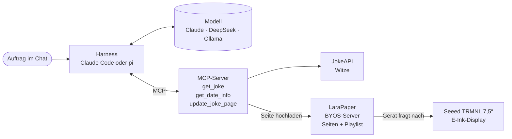

# KI-Agenten selbst bauen · Harness, MCP und ein E-Ink-Display

!!! abstract "Worum es geht"
    Wie baut man heute mit Sprachmodellen etwas, das **tatsächlich handelt**, statt
    nur zu chatten? Dieser Guide erklärt die drei Bausteine **Modell, Harness und MCP**.
    Er zeigt sie an einem konkreten Projekt, in dem ein Agent einen Witz aus der
    JokeAPI holt, ihn auswählt, übersetzt und kürzt und als „Witz des Tages“ auf ein
    TRMNL-E-Ink-Display bringt.

## Was man danach verstanden hat

1. Was ein **Harness** ist und warum er mindestens so wichtig ist wie das Modell.
2. Wie man einen **eigenen Harness** aufsetzt, und zwar mit [pi](https://pi.dev),
   wahlweise mit DeepSeek in der Cloud oder einem lokalen Modell über Ollama.
3. Was **MCP** ist. Es ist der Standard, über den ein Agent Werkzeuge nutzt, egal
   welches Modell dahintersteckt. Im Kern ist MCP eine **Erweiterung** bestehender
   Technik (APIs) und keine Revolution.
4. Worauf es bei einem **MCP-Server** wirklich ankommt, gezeigt an den Tools
   `get_joke`, `get_date_info` und `update_joke_page`.
5. Wo ein **Agent** sinnvoll ist und wo **normaler Code** besser ist (→ Seite 6, Regel 4,
   und Seite 9).
6. Wie man mit einem **Agenten** einen MCP-Server baut. Das erste Tool entsteht von
   Hand, den Rest baut der Harness aus der Spezifikation (→ Seite 7).

## Leitfaden

Die Seiten bauen aufeinander auf. Wir gehen sie der Reihe nach durch und machen dort
weiter, wo wir beim letzten Mal aufgehört haben.

**Verstehen**

| # | Seite | Live-Anteil |
|---|---|---|
| 1 | [Die Bausteine](01-bausteine.md) | kein Live-Teil |
| 2 | [Wie ein Harness funktioniert](02-harness.md) | eine API gemeinsam auswählen und beschreiben |
| 3 | [Eigenen Harness aufsetzen mit pi](03-pi-aufsetzen.md) | pi installieren, zwischen DeepSeek und Ollama wechseln |
| 4 | [MCP verstehen](04-mcp-grundlagen.md) | MCP Inspector, derselbe Server in pi und Claude Code |
| 5 | [Von der API zum MCP-Server](05-api-zu-mcp.md) | dieselbe API per `curl` und als Tool |
| 6 | [Was bei einem MCP-Server zählt](06-mcp-was-zaehlt.md) | Beschreibungen im Vergleich |

**Bauen**

| # | Seite | Inhalt |
|---|---|---|
| 7 | [Selbst bauen](07-selbst-bauen.md) | Server aufsetzen, `get_joke` von Hand, den Rest baut der Harness, testen und spielen |
| 8 | [Der Ablauf vom Auftrag zum Display](08-ablauf.md) | Witz des Tages und Tagesplaylist, Harness und Modell im Vergleich, einen Fehler gezielt korrigieren, bewusst kaputt machen |
| 9 | [Abschluss und Einordnung](09-abschluss.md) | Wann Agent, wann Code? Risiken, nächste Schritte |

!!! tip "Was man nicht auslassen sollte"
    Der Kern sind die **Seiten 1, 2, 4 und 6**. Seite 3 (pi) lässt sich auf „einmal
    Modell wechseln“ kürzen und Seite 5 auf das Beispiel Seite an Seite. Seite 8 ist
    ein **Baukasten**, aus dem wir die Akte zeigen, für die Seite 7 die Grundlage
    geschaffen hat.

## Das Beispielprojekt in einem Bild

Der Auftrag lautet sinngemäß *„Mach mir den Witz des Tages, gern was mit Kaffee.“* **Das Modell
entscheidet selbst**, welche Tools es in welcher Reihenfolge aufruft. Der Harness
führt die Aufrufe aus, und der MCP-Server erledigt die eigentliche Arbeit.

Ein Bild rendert dabei niemand von uns. Der MCP-Server überschreibt eine fertige
**Seite** in LaraPaper mit dem neuen Witz. LaraPaper rendert sie und zeigt sie an,
sobald sie in der Playlist des Geräts an der Reihe ist.

## Aufbau jeder Seite

- **Einleitung** mit dem, worum es geht und was hängen bleiben soll
- **Inhalt** mit Erklärungen und kurzen, kommentierten Ausschnitten
- **Live** mit dem, was an dieser Stelle gezeigt wird
